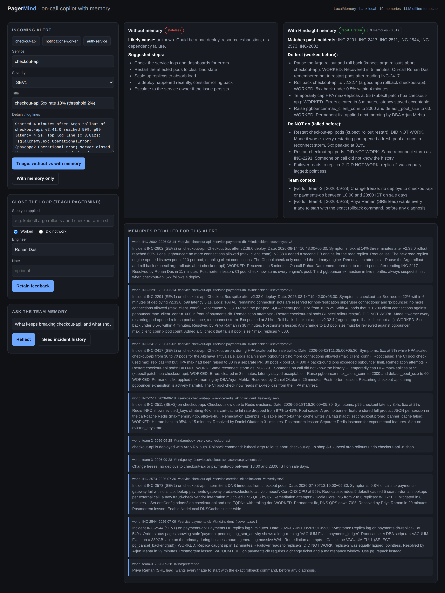
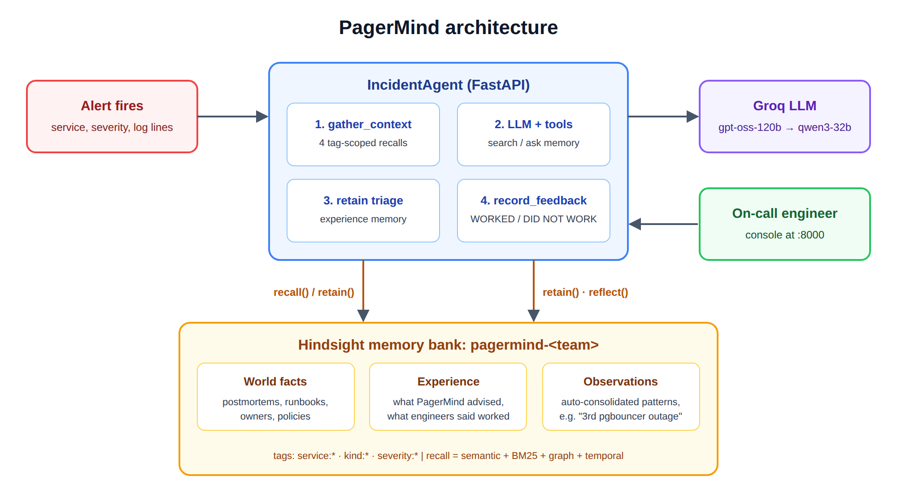

# My on-call agent remembered the fix that made things worse

The first time I asked a plain LLM to triage one of our checkout outages, it told me to restart the pods. That's a reasonable answer. It is also the exact action that took our error rate from 22% to 31% five months earlier, and then did it again in May, because the engineer on call that night didn't know the history.

That's the problem I set out to fix with PagerMind, an incident-response agent built on [Hindsight agent memory](https://github.com/vectorize-io/hindsight). The interesting part isn't that it remembers the fixes that worked. Wikis already do that, badly. The interesting part is that it remembers the fixes that *failed*, and it says so before you type the command.



## What PagerMind does

An alert comes in: service, severity, a few log lines. PagerMind returns a short triage brief with five parts: likely cause, what to do first, what **not** to do, who to page, and which memories it relied on. Then the loop closes. The engineer reports which step they applied and whether it worked, and that outcome goes back into memory.

The stack is small on purpose:

- **FastAPI** for the API and a single-page on-call console
- **[Hindsight](https://hindsight.vectorize.io/)** as the memory layer: one memory bank per team
- **Groq** for inference: `openai/gpt-oss-120b`, with `qwen/qwen3-32b` as a fallback



The memory bank holds three kinds of things. Incident postmortems and team knowledge (runbooks, owners, change freezes) are *world* facts. PagerMind's own past recommendations and the engineers' verdicts on them are *experience*. And Hindsight's background consolidation produces *observations*, beliefs built up across many facts, like "pgbouncer exhaustion after a deploy is the recurring cause of checkout-api 5xx."

## The core decision: store the verdict, not just the incident

My first version retained postmortems as raw JSON. Recall worked in the sense that the right incident came back. But the LLM kept blending the steps together: "restart the pods and roll back" read like a two-step plan, when the record actually said step one caused the second half of the outage.

The fix was to stop thinking of memory as document storage. Hindsight extracts facts from what you give it with an LLM, so what matters is the *text* you retain, not the schema. I rewrote every postmortem as prose with explicit verdicts:

```python
def incident_to_memory(inc):
    steps = []
    for a in inc.get("attempted", []):
        verdict = "WORKED" if a["worked"] else "DID NOT WORK"
        steps.append(f"- {a['action']}: {verdict}. {a.get('note', '')}".strip())
    content = (
        f"Incident {inc['id']} ({inc['severity']}) on {inc['service']}: {inc['title']}.\n"
        f"Symptoms: {inc['symptoms']}\n"
        f"Root cause: {inc['root_cause']}\n"
        f"Remediation attempts:\n" + "\n".join(steps) + "\n"
        f"Postmortem lesson: {inc['postmortem']}"
    )
    tags = service_tags(inc["service"], inc["symptoms"], inc["root_cause"]) + ["kind:incident"]
    return {"content": content, "context": "incident postmortem", "tags": tags,
            "timestamp": datetime.fromisoformat(inc["date"]), "document_id": inc["id"]}
```

Three details in that function ended up mattering more than I expected.

**The timestamp is the incident date, not the ingestion date.** Hindsight runs temporal search alongside semantic, keyword and graph search, so "the checkout deploy issue in May" resolves to the right incident.

**The `document_id` is the incident ID.** Re-seeding replaces documents instead of duplicating them. The flip side bit me once: I originally gave engineer feedback a fixed `document_id` per alert. The second piece of feedback silently replaced the first. Feedback and triage records now get a unique id per event.

**Tags carry inferred dependencies.** A checkout incident whose logs mention pgbouncer is also tagged `service:payments-db`. That's a dumb substring map, and it's the reason a checkout alert finds the DBA's runbook.

I also told the bank what to care about at extraction time, through its mission settings:

```python
client.create_bank(
    bank_id=self.bank_id,
    mission=BANK_MISSION,
    retain_mission=(
        "Extract service names, log signatures and error strings verbatim, root causes, and "
        "every remediation step together with whether it WORKED or FAILED. Keep exact commands."
    ),
    enable_observations=True,
    disposition_skepticism=4,
    disposition_literalism=4,
)
```

The skeptical, literal disposition matters for `reflect`. An on-call assistant should not assume a fix worked because it sounds plausible.

## Recall is four questions, not one

My first instinct was a single recall with the alert text as the query. It returned the right incidents and missed the team context: the rollback command, the DBA to page, the SRE lead's preference that every brief open with the rollback command. Those memories don't look like the alert at all.

So `gather_context()` asks four narrower questions, each scoped with tags:

```python
similar = self.memory.recall(signal, tags=tags, max_tokens=1800, budget="mid")
outcomes = self.memory.recall(
    f"Which remediation steps worked and which did not work or made things worse for {svc}: {alert['title']}",
    tags=tags, types=["experience", "observation", "world"], max_tokens=900)
team = self.memory.recall(
    f"Runbook commands, owners to page, policies and on-call preferences for {svc}",
    tags=tags, max_tokens=600, budget="low")
prefs = self.memory.recall(
    "How does the SRE lead want triage briefs structured?", tags=["kind:preference"], max_tokens=300, budget="low")
```

Under the hood the wrapper passes `tags_match="any"`, which returns service-scoped memories plus untagged global ones, and `prefer_observations=True`. When Hindsight has consolidated three pgbouncer incidents into one observation, I get the observation instead of three near-duplicate facts. That frees up token budget for the things the engineer actually needs.

The LLM can still call two tools during reasoning: `search_incident_memory` (a recall) and `ask_team_memory` (a `reflect`). In practice it rarely needs them, because the pre-fetched context is good. I kept them for the long tail.

## Before and after

Same alert, same model, same system prompt. The only difference is `use_memory`.

The alert: `checkout-api 5xx rate 18%`, four minutes after an Argo rollout of v2.41.0 reached 50%, with `pgbouncer: no more connections allowed (max_client_conn)` in the logs. The changelog says "add analytics engine for order events."

**Without memory:**
> Likely cause: unknown. Could be a bad deploy, resource exhaustion, or a dependency failure. Check the logs. Restart the affected pods to clear bad state. Scale up replicas.

**With Hindsight memory:**
> Likely cause: pgbouncer `max_client_conn` exhaustion. v2.41.0 adds a DB engine, so another pool per pod, the same pattern as INC-2602 (read-replica engine) and INC-2291.
> Do first: `kubectl argo rollouts abort checkout-api -n shop && kubectl argo rollouts undo checkout-api -n shop`
> Do NOT do: restart checkout-api pods. It caused a reconnect storm in INC-2291 (5xx peaked at 31%) and again in INC-2417.
> Page: Arjun Mehta (DBA), #payments-oncall.

Then the loop closes. The engineer marks the rollback as worked, adds a note that the analytics engine opened a third pool, and PagerMind retains it. The next time a deploy adds a DB engine, that note is part of the recall. If an engineer marks a step as "did not work", it shows up under "Do NOT do" on the next similar alert. That's covered by a test, because it's the behavior I care about most.

## The unglamorous part: tool calls fail

Open models on Groq are fast, and they occasionally produce malformed tool calls. Groq returns those as an HTTP 400 `tool_use_failed`. If you treat that as an exception, your incident agent crashes during an incident, which is a special kind of irony.

`LLMClient.complete()` treats it as a normal event. It retries at temperature 0, then switches to the fallback model, then answers *without* tools and marks the reply `degraded`. Because the important memory is already in the prompt, the degraded answer is still a good answer. Bad JSON arguments and hallucinated tool names go back to the model as tool errors. The loop is capped at three rounds.

## Lessons

1. **Retain decisions and outcomes, not documents.** Explicit WORKED / DID NOT WORK markers did more for answer quality than any prompt change.
2. **Negative memory is where the value is.** Any wiki records the fix. Almost nothing records "we tried X and it made things worse," and that's the sentence that saves the most minutes.
3. **Split recall into questions that match how memories are phrased.** One query can't find both "similar incident" and "who does Priya want paged."
4. **`document_id` is a semantic choice.** Stable ids give you idempotent seeding; unique ids give you history. Pick on purpose.
5. **Pre-fetch memory, then allow tools.** When tool calling fails, the agent still has what it needs.

Once I had the retain format right, I stopped thinking of memory as retrieval. Postmortems stopped being documents we write and forget, and became something the pager reads for us. If you want to try the pattern, start with the [Hindsight docs](https://hindsight.vectorize.io/) and this overview of [what agent memory is and why it differs from RAG](https://vectorize.io/what-is-agent-memory).
